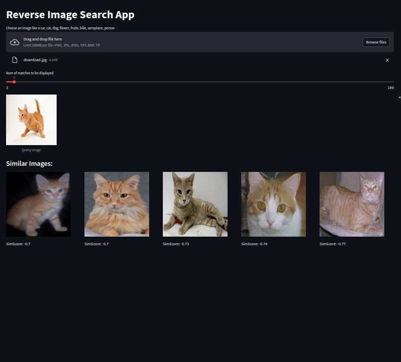

# Image Reverse Search Web App

## Description

### A very fast reverse image search webapp in streamlit using NVIDIA's EfficientNet and Facebook's Faiss library. 70000 images (224x224), 4GB GTX1650: FAISS GPU in 10 secs vs 30 mins with Annoy CPU

Upload a picture, and AI powered by deep learning will instantly show you visually related matches. Explore and discover connections through the magic of image recognition.

## Demo

Experience the app in action right in your browser: https://huggingface.co/spaces/Instantaneous1/search-by-image



## Key Features

- Upload a query image to find visually similar images in the dataset.
- Explore retrieved images to discover related content.
- Adjust the number of matches displayed for visual comparisons.
- Utilizes a pre-trained image feature extractor model (EfficientNet-b0) for accurate image similarity.
- Employs FAISS index for fast approximate nearest neighbor search.
- Offers a user-friendly interface powered by Streamlit.

## Getting Started

1. Clone this repository:

```bash
git clone [git@github.com:sayan1999/search-by-image.git](git@github.com:sayan1999/search-by-image.git)
```

2. Install required libraries:

```bash
pip install -r requirements.txt
```

3. Run the Streamlit app:

for quickly dl embeddings and skipp training

```bash
streamlit run app.py
```

or

to rebuild embeddings

```bash
streamlit run app.py -- --dev
```

4. Access the app in your web browser (usually at http://localhost:8501).

## Technology Stack

Streamlit: Framework for building and deploying web apps in Python.
Torch: Powerful deep learning framework.
OpenDatasets: Library for convenient dataset downloading.
FAISS: Facebook's fast AI vector similarity search
NVIDIA EfficientNet-b0: Pre-trained image classification model for feature extraction.

## Usage

1. Access the app in your web browser at the provided link (usually http://localhost:8501).
2. Click the "Upload Image" button and select an image from your computer.
3. Optionally, adjust the number of matches using the slider.
4. Click the "Search" button to initiate the reverse image search.
5. The app will display the query image along with the retrieved similar images.

## Dataset

[https://www.kaggle.com/datasets/kkhandekar/image-dataset](https://www.kaggle.com/datasets/kkhandekar/image-dataset)
